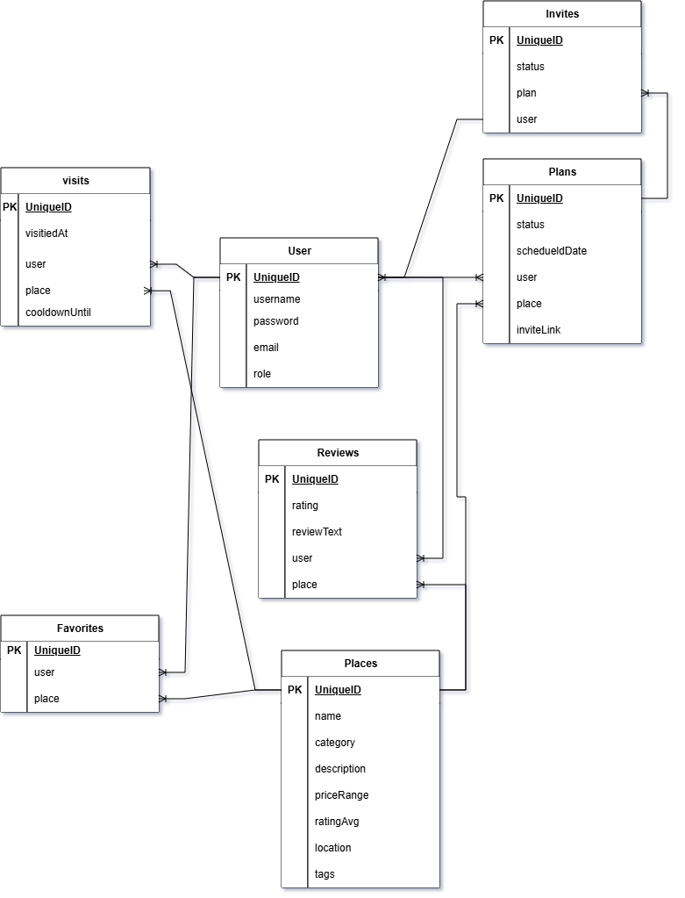

# Tal'a Backend API

## Overview
**Tal'a - طلعة**, is an app for going out in Bahrain. Tal'a recommends places and events for people who often visits the same places or who don't know where to go, relying on users's visits history and locations and preventing them from going to places they have already been to.

## Related Links
- Backend API: [Deployed Backend](https://tala-backend-83km.onrender.com/)
- Frontend App: [Deployed Frontend](https://talafrontend.netlify.app/)
- Frontend Repo: [Frontend GitHub Repository](https://github.com/WA-2211/Tala-Frontend)

## Technologies Used
- Node.js
- Express
- MongoDB
- Mongoose
- JWT
- bcrypt
- dotenv
- Morgan
- CORS
- Leaflet

## Features
- User signup and login with hashed passwords
- JWT-based authentication middleware
- Role-based authorization (guest/ user / admin)
- Full CRUD for places, visits, favorites, reviews, plans, and invites
- Weighted recommendation engine (category balance, visit history, cooldown, rating)
- Geospatial "places near me" search using MongoDB `$geoNear`
- Combined filtering by category, price range, and minimum rating
- Cooldown logic preventing repeat visit recommendations
- Automatic place rating recalculation on review create/delete
- Shareable, publicly viewable plan invite links (no login required to view)
- Account-based invite system with accept/reject flow

## Project Structure
```
server/
├── config/
├── controllers/
├── middleware/
├── models/
├── routes/
├── app.js
└── server.js
```
## Folder Responsibilities
| Folder | Purpose |
|---|---|
| config | Database and application configuration |
| controllers | HTTP request and response handling |
| middleware | Authentication and authorization middleware |
| models | Mongoose schemas and models |
| routes | Express route definitions |
| app.js | Express application configuration |
| server.js | Database connection and server startup |

## Getting Started

### Prerequisites
- Node.js
- MongoDB 

### Installation
**Clone the repo**

git clone https://github.com/WA-2211/Tala-Backend

cd Tala-Backend

**Install dependencies**

npm i

**Create the environment file**
Create .env file

PORT=3000
MONGODB_URI=your-connection-string
CLIENT_URL=http://localhost:5173
JWT_SECRET=unique-password-no-one-would-guess

**Start the development server**
npm run dev

## Database Models

### User
 
| Field | Type | Rules |
|---|---|---|
| username | String | Required, unique, trimmed |
| email | String | Required, unique, lowercase |
| hashedPassword | String | Required, hashed with bcrypt, excluded from responses |
| role | String | `user` or `admin`, defaults to `user` |
| createdAt | Date | Generated automatically |
| updatedAt | Date | Generated automatically |
 
### Place
 
| Field | Type | Rules |
|---|---|---|
| name | String | Required, 3–100 characters |
| category | String | Required, enum of place categories |
| description | String | Required, max 500 characters |
| priceRange.category | String | Required, `affordable` / `midrange` / `premium` |
| priceRange.averageBHD | Number | Optional |
| ratingAvg | Number | 0–5, calculated automatically from reviews, defaults to 0 |
| tags | [String] | Free-form tags |
| location.type | String | `Point` (GeoJSON) |
| location.coordinates | [Number] | `[longitude, latitude]` |
| startDate / endDate | Date | Required only when category is `event` |
| createdAt / updatedAt | Date | Generated automatically |
 
### Visit
 
| Field | Type | Rules |
|---|---|---|
| user | ObjectId | Required, references User |
| place | ObjectId | Required, references Place |
| visitedAt | Date | Defaults to now |
| coolDownUntil | Date | Set on creation, used to exclude the place from recommendations temporarily |
 
### Favorite
 
| Field | Type | Rules |
|---|---|---|
| user | ObjectId | Required, references User |
| place | ObjectId | Required, references Place |
| — | — | Unique compound index on (user, place) prevents duplicates |
 
### Review
 
| Field | Type | Rules |
|---|---|---|
| user | ObjectId | Required, references User |
| place | ObjectId | Required, references Place |
| rating | Number | Required, 1–5 |
| reviewText | String | Optional |
 
### Plan
 
| Field | Type | Rules |
|---|---|---|
| user | ObjectId | Required, references User (the plan owner) |
| place | ObjectId | Required, references Place |
| status | String | `scheduled` / `completed` / `cancelled`, defaults to `scheduled` |
| scheduledDate | Date | Optional |
| inviteLink | String | Auto-generated unique token for public sharing |
 
### Invite
 
| Field | Type | Rules |
|---|---|---|
| user | ObjectId | Required, references User (the invited person) |
| plan | ObjectId | Required, references Plan |
| status | String | `pending` / `accepted` / `rejected`, defaults to `pending` |

## Entity Relationships


## API Base URL
[Deployed Tal'a Backend Link](https://tala-backend-83km.onrender.com/)

## Endpoints

### Auth
| Method | Endpoint      | Access        | Description                     |
|--------|---------------|---------------|----------------------------------|
| GET    | /auth/me      | Authenticated | Get the current user's profile  |
| POST   | /auth/sign-up | Public        | Create a new user account       |
| POST   | /auth/sign-in | Public        | Authenticate and receive a JWT  |

### Place
| Method | Endpoint            | Access        | Description                      |
|--------|---------------------|---------------|----------------------------------|
| GET    | /place              | Public        | Get all places                   |
| POST   | /place              | Admin         | Create a place                   |
| GET    | /place/recommended  | Authenticated | Get personalized recommendations |
| GET    | /place/:placeId     | Public        | Get one place                    |
| PUT    | /place/:placeId     | Admin         | Update a place                   |
| DELETE | /place/:placeId     | Admin         | Delete a place                   |
| GET    | /place/place-nearby | Authenticated | Get places by distance           |
### Visit
| Method | Endpoint        | Access        | Description                          |
|--------|-----------------|---------------|--------------------------------------|
| GET    | /visit          | Authenticated | Get the current user's visit history |
| POST   | /visit          | Authenticated | Log a new visit                      |
| GET    | /visit/:visitId | Owner         | Get one visit                        |
| DELETE | /visit/:visitId | owner         | Delete a visit                       |
### Favorite
| Method | Endpoint              | Access        | Description                      |
|--------|-----------------------|---------------|----------------------------------|
| GET    | /favorite             | Authenticated | Get the current user's favorites |
| POST   | /favorite             | Authenticated | Favorite a place                 |
| DELETE | /favorite/:favoriteId | Owner         | Remove a favorite                |
### Review
| Method | Endpoint               | Access        | Description                 |
|--------|------------------------|---------------|-----------------------------|
| GET    | /place/:placeId/review | Public        | Get all reviews for a place |
| POST   | /place/:placeId/review | Authenticated | Create a review             |
### Plan 
| Method | Endpoint                 | Access        | Description                                          |
|--------|--------------------------|---------------|------------------------------------------------------|
| GET    | /plan                    | Authenticated | Get the current user's plans                         |
| POST   | /plan                    | Authenticated | Create a plan for a place & generates an invite link |
| GET    | /plan/:planId            | Owner         | Get one plan                                         |
| PUT    | /plan/:planId            | Owner         | Update a plan's details                              |
| DELETE | /plan/:planId            | Owner         | Delete a plan                                        |
| GET    | /plan/invite/:inviteLink | Public        | View a plan's details via its link                   |
### Invite
| Method | Endpoint                  | Access        | Description                                  |
|--------|---------------------------|---------------|-----------------------------------------------|
| POST   | /plan/:planId/invite      | Owner         | Invite a user to a plan by username           |
| GET    | /plan/:planId/invite      | Owner         | Get all invites for a plan                    |
| GET    | /invite                   | Authenticated | Get the current user's invites                |
| PUT    | /invite/:inviteId         | Invited user  | Accept or reject an invite                    |
| POST   | /plan/invite/:inviteLink  | Authenticated | Join a plan via its public invite link        |

## Status Codes
| Status | Meaning in this API |
|---|---|
| 200 | Successful request |
| 201 | Resource created |
| 400 | Invalid request (validation error, malformed ID) |
| 401 | Authentication required or invalid token |
| 403 | Authenticated but not permitted (not owner/admin) |
| 404 | Resource not found |
| 409 | Resource conflict (e.g. duplicate username) |
| 500 | Unexpected server error |
## Future Enhancements
- Real business account for venues to post live updates


## Team Members
 
| Name | GitHub | Responsibilities |
|---|---|---|
| Walaa Idrees | [GitHub profile](https://github.com/WA-2211) | Full-stack development |
## Credits
Built By Walaa Idrees as a part of Software Engineering Bootcamp final project